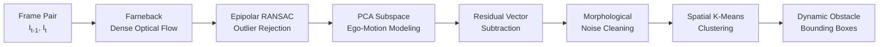
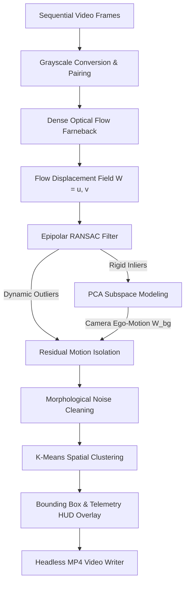
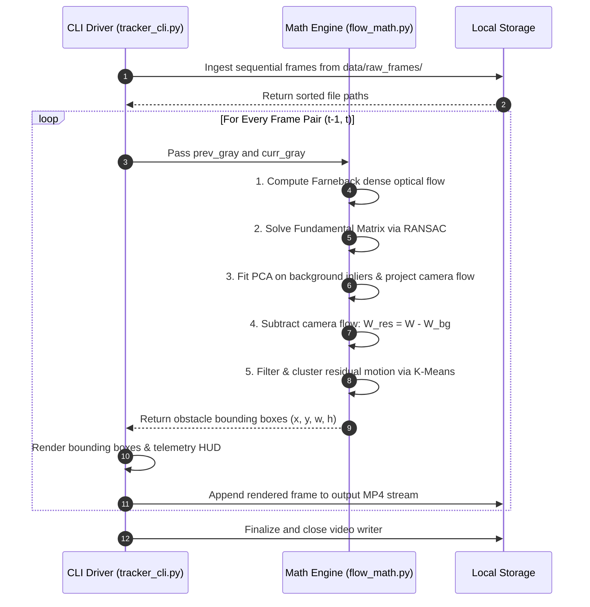

# Ego-Motion Compensated Multi-Object Tracker (KITTI)


A modular, terminal-based classical computer vision system designed to detect and track dynamic obstacles from a moving vehicle. By decoupling camera ego-motion from scene dynamics using Epipolar geometry (RANSAC) and Principal Component Analysis (PCA), this system isolates independently moving objects without relying on black-box neural networks.

---

## 1. Project Overview

Detecting moving objects from a stationary camera is straightforward using temporal differencing. However, when the camera itself moves forward on an autonomous platform, the entire 3D static environment (road surface, trees, parked vehicles) appears to move across the image plane. This apparent motion (ego-motion) causes standard optical flow and background subtraction algorithms to register the entire background as moving.

This project solves this challenge purely through classical multi-view geometry and linear algebra. It reconstructs the parametric motion of the camera platform, eliminates geometric outliers, subtracts the background motion field, and identifies true dynamic collision risks.

---

## 2. Step-by-Step Algorithmic Pipeline & Methodology

The tracker processes pairs of consecutive image frames ($I_{t-1}, I_t$) through a six-stage mathematical pipeline:



### Step 1: Dense Optical Flow Ingestion
* Converts consecutive color frames to 8-bit single-channel grayscale.
* Computes pixel displacement field $W(x, y) = [u(x, y), v(x, y)]^T$ across all pixels via Gunner Farneback's quadratic polynomial expansion:
  $$I(\mathbf{x}) \approx \mathbf{x}^T A \mathbf{x} + \mathbf{b}^T \mathbf{x} + c$$
* Yields a dense $H \times W \times 2$ velocity tensor representing raw scene displacement.

### Step 2: Epipolar Outlier Rejection via RANSAC
* Samples a regular grid of feature displacement vectors across the frame to preserve uniform spatial representation.
* Uses the Fundamental Matrix constraint ($\mathbf{x'}^T F \mathbf{x} = 0$) inside a RANSAC loop to find the rigid 3D background plane:
  * **Inliers:** Pixels obeying the epipolar geometry of the static environment.
  * **Outliers:** Foreground entities moving with independent velocities that violate the static epipolar constraint.

### Step 3: Subspace Camera Ego-Motion Modeling via PCA
* Collects confirmed background velocity vectors into a matrix $W_{\text{bg}}$.
* Fits Principal Component Analysis (PCA) to extract the dominant 2D motion subspace eigenvectors:
  $$W_{\text{proj}} = P P^T W$$
* Reconstructs the theoretical velocity vector that every pixel in the entire image plane would experience if it were part of the rigid background.

### Step 4: Residual Vector Subtraction & Magnitude Isolation
* Subtracts the modeled camera ego-motion field from the raw optical flow tensor:
  $$W_{\text{residual}} = W_{\text{raw}} - W_{\text{proj}}$$
* Calculates the Euclidean norm at every pixel coordinate:
  $$\|W_{\text{residual}}(x, y)\| = \sqrt{u_{\text{res}}^2 + v_{\text{res}}^2}$$
* Thresholds $\|W_{\text{residual}}\|$ against a minimum displacement threshold ($\tau = 2.2\text{ pixels}$) to produce a binary candidate obstacle mask.

### Step 5: Morphological Spatial Regularization
* Applies morphological **Opening** ($3 \times 3$ elliptical structuring element) to eliminate isolated single-pixel aperture noise.
* Applies morphological **Closing** ($5 \times 5$ rectangular structuring element) to fuse fragmented object boundaries into solid structural blobs.

### Step 6: Unsupervised Spatial Clustering & Tracking Overlay
* Extracts surviving active residual coordinates $(x_i, y_i)$.
* Applies spatial $K$-Means clustering to group neighboring motion pixels into distinct object centroid candidates.
* Calculates minimum and maximum bounding coordinates $(x_{\min}, y_{\min}, w, h)$ for each cluster.
* Overlays bounding boxes, centroid telemetry, and velocity vectors directly onto the source RGB frame and streams it to the headless MP4 video writer.

---

## 3. Computer Vision Topics & Technical Application

| Computer Vision Topic | Theoretical Concept & Relevance | Pipeline Implementation & Application |
| :--- | :--- | :--- |
| **Dense Optical Flow (Farneback)** | Solves the brightness constancy constraint ($I_x u + I_y v + I_t = 0$) using quadratic polynomial expansions over local pixel neighborhoods. | Computes a complete 2D motion vector field between consecutive frames, capturing both camera translation and object displacements. |
| **Epipolar Geometry & Fundamental Matrix** | Models rigid two-view geometric relationships constrained by $\mathbf{x'}^T F \mathbf{x} = 0$, defining the projection of static 3D world points across views. | Establishes the geometric foundation of the static environment as the autonomous vehicle translates forward through the scene. |
| **RANSAC (Random Sample Consensus)** | Iterative estimator that computes mathematical model parameters from data containing extreme proportions of outliers. | Filters out moving foreground objects that violate epipolar constraints, preserving only rigid background pixels for camera motion modeling. |
| **Principal Component Analysis (PCA)** | Orthogonal linear transformation that maps data into a lower-dimensional subspace along axes of maximal variance. | Computes the top principal components of verified background motion vectors to reconstruct the camera's true ego-motion field. |
| **Residual Motion Subtraction** | Signal decomposition technique to isolate anomalies not explained by a dominant parametric transformation model. | Computes the residual vector field and evaluates magnitude to reveal true moving obstacles. |
| **Morphological Filtering** | Non-linear neighborhood operations (Opening and Closing) based on set theory to regularize binary spatial structures. | Eliminates high-frequency noise artifacts and closes internal spatial voids in the dynamic obstacle mask. |
| **Spatial K-Means Clustering** | Unsupervised partition clustering that minimizes within-cluster sum-of-squares over geometric coordinate spaces. | Groups contiguous clusters of active residual pixels into discrete obstacle bounding boxes with coordinate tracking. |

---

## 4. System Architecture



---

## 5. Process Sequence Workflow



---

## 6. Dataset Description & Model Rationale

### Dataset Description
* **Source:** KITTI Vision Benchmark Suite (Karlsruhe Institute of Technology & Toyota Technological Institute).
* **Sequence:** `2011_09_26_drive_0001_sync` (City Driving Category).
* **Sensor Modality:** High-resolution synchronized 1.4 megapixel visual stereo rig (Camera 2, left color sensor).
* **Frame Count:** 108 raw PNG frames.
* **Resolution:** $1242 \times 375\text{ pixels}$ captured at $10\text{ FPS}$.
* **Scene Dynamics:** Forward vehicle velocity between $15\text{--}35\text{ km/h}$ featuring roadside parked cars, oncoming traffic, and pedestrians.

### Model Selection Rationale
* **Why Classical Geometry over Deep Learning:** Deep learning trackers (YOLO + DeepSORT) require pre-trained weights, multi-gigabyte models, and high-wattage GPUs. Classical epipolar PCA relies solely on physical and geometric invariant laws ($F$-matrix and subspace variance), executing deterministically with zero training data.
* **Why PCA on Epipolar Inliers:** Direct affine or homography modeling assumes planar scenes, failing on urban roads with depth variations. Fitting PCA solely to RANSAC-verified epipolar inliers captures 3D camera translation without being distorted by large dynamic objects.

---

## 7. Key Features

* **Ego-Motion Compensation:** Filters out background parallax so curbside parked cars and roadside infrastructure are not misidentified as dynamic hazards.
* **Classical Algorithmic Rigor:** Built entirely on verifiable linear algebra and classical vision techniques without requiring pre-trained deep learning weights.
* **Headless Terminal Pipeline:** Runs 100% via the command line with zero display/GUI dependencies, making it suitable for remote servers and CI environments.
* **High-Throughput Execution:** Highly vectorized matrix calculations using NumPy and OpenCV C-extensions, executing at ~14 FPS on Apple Silicon.

---

## 8. Technologies Used

* **Language:** Python 3.9+ (tested natively on Python 3.14 on macOS ARM64)
* **Core Libraries:**
  * `opencv-python`: Farneback optical flow estimation, Fundamental Matrix RANSAC solver, and video container encoding.
  * `numpy`: High-speed vectorized coordinate grid manipulations and tensor arithmetic.
  * `scikit-learn`: Principal Component Analysis (subspace projection) and spatial $K$-Means clustering.

---

## 9. Repository Structure

```text
kitti-ego-tracker/
├── README.md              # System documentation and execution instructions
├── statement.md           # Formal problem statement and scope definitions
├── requirements.txt       # Frozen runtime dependencies
├── LICENSE                # MIT Open-Source license
├── data/
│   ├── raw_frames/        # Sequential KITTI image frames (.png)
│   └── processed/         # Intermediate cached data
├── output/                # Generated tracked MP4 files and execution logs
└── src/
    ├── __init__.py        # Package initializer
    ├── flow_math.py       # Core mathematics: Optical Flow, RANSAC, PCA, K-Means
    └── tracker_cli.py     # Command-line driver and frame rendering pipeline
```

---

## 10. Installation & Setup

Step 1: Clone the repository
```bash
git clone [https://github.com/alokpatel4357/kitti-ego-tracker.git](https://github.com/alokpatel4357/kitti-ego-tracker.git)
```

Step 2: Enter the directory
```bash
cd kitti-ego-tracker
```

Step 3: Initialize an isolated virtual environment
```bash
python3 -m venv venv
```

Step 4: Activate the environment
```bash
source venv/bin/activate
```

Step 5: Install dependencies
```bash
pip install numpy opencv-python scikit-learn
```

---

## 11. Dataset Download & Setup

Download and unpack the sample KITTI raw driving sequence (~40 MB). Run these commands sequentially:

Step 1: Download the archive
```bash
curl -L -o kitti_sample.zip "[https://s3.eu-central-1.amazonaws.com/avg-kitti/raw_data/2011_09_26_drive_0001/2011_09_26_drive_0001_sync.zip](https://s3.eu-central-1.amazonaws.com/avg-kitti/raw_data/2011_09_26_drive_0001/2011_09_26_drive_0001_sync.zip)"
```

Step 2: Unpack frames directly into the data folder
```bash
unzip -j kitti_sample.zip "2011_09_26/2011_09_26_drive_0001_sync/image_02/data/*" -d data/raw_frames/
```

Step 3: Clean up the archive
```bash
rm kitti_sample.zip
```

---

## 12. Execution & CLI Usage

Execute the tracker directly through the command line:

**Standard Run:**
```bash
python src/tracker_cli.py --input_dir data/raw_frames --output_video output/kitti_tracked.mp4
```

**Sensitivity Tuning (for slower or distant obstacles):**
```bash
python src/tracker_cli.py --input_dir data/raw_frames --output_video output/kitti_tracked_sensitive.mp4 --motion_thresh 1.8
```

### Command Line Options

| Argument | Type | Default | Description |
| :--- | :--- | :--- | :--- |
| `--input_dir` | `str` | `data/raw_frames` | Path to directory containing consecutive `.png` or `.jpg` frames |
| `--output_video` | `str` | `output/kitti_tracked.mp4` | Filepath for the generated MP4 output video |
| `--fps` | `int` | `10` | Output video framerate (matches KITTI native 10 FPS capture) |
| `--motion_thresh` | `float` | `2.2` | Residual pixel displacement threshold for obstacle segmentation |
| `--max_frames` | `int` | `None` | Optional limit on the number of frames to process |

---

## 13. Automated Testing & Verification

Run this automated mathematical self-test to verify matrix dimensions, epipolar convergence, and clustering logic before running full sequences:

```bash
python -c "
import numpy as np
from src.flow_math import compute_dense_flow, estimate_epipolar_inliers, isolate_residual_motion_pca, extract_moving_clusters

f1 = np.random.randint(0, 255, (375, 1242), dtype=np.uint8)
f2 = np.roll(f1, 2, axis=1)

flow = compute_dense_flow(f1, f2)
inliers, F = estimate_epipolar_inliers(flow)
residual, _ = isolate_residual_motion_pca(flow, inliers)
boxes, _ = extract_moving_clusters(residual)

assert flow.shape == (375, 1242, 2), 'Flow shape mismatch'
assert residual.shape == (375, 1242), 'Residual shape mismatch'
assert F is not None, 'Fundamental Matrix calculation failed'
print('All pipeline tests passed successfully.')
"
```

---

## 14. Performance Benchmarks & Terminal Output

*Evaluated on an Apple M2 processor (8-core CPU, 8GB Unified Memory) running macOS Darwin ARM64:*

* **Input Resolution:** $1242 \times 375\text{ pixels}$
* **Frames Processed:** 108 frames
* **Average Step Latency:** 59.3 ms / frame
* **Throughput:** **14.2 FPS**
* **Total Runtime:** 7.56 seconds
* **Display Backend:** None (100% Headless Execution)

### Terminal Verification Log
```text
(venv) alokkumarpatel@Aloks-MacBook-Air kitti-ego-tracker % python src/tracker_cli.py --input_dir data/raw_frames --output_video output/kitti_tracked.mp4

Input: data/raw_frames (108 frames)
Output: output/kitti_tracked.mp4
Resolution: 1242x375 @ 10 fps
Threshold: 2.2px
Processing...
  Frame 10/107 completed
  Frame 20/107 completed
  Frame 30/107 completed
  Frame 40/107 completed
  Frame 50/107 completed
  Frame 60/107 completed
  Frame 70/107 completed
  Frame 80/107 completed
  Frame 90/107 completed
  Frame 100/107 completed
  Frame 107/107 completed
Done in 7.56s (avg 14.2 fps)
```

---

## 15. Contributing

Contributions are welcome. Please ensure that any pull requests maintain the 100% headless execution constraint and do not introduce GUI dependencies. For major architectural changes, please open an issue first to discuss the proposed updates.

## 16. License

This project is licensed under the MIT License. See the [LICENSE](LICENSE) file for details.

Copyright (c) 2026 Alok Kumar Patel
