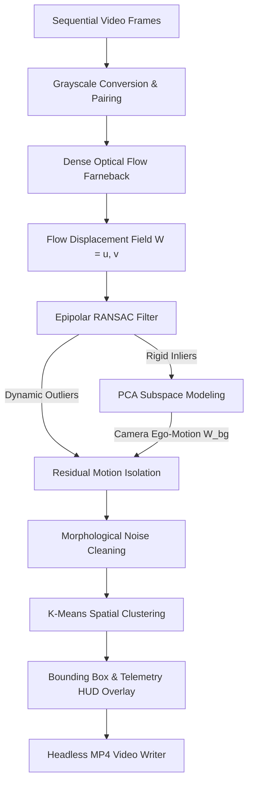
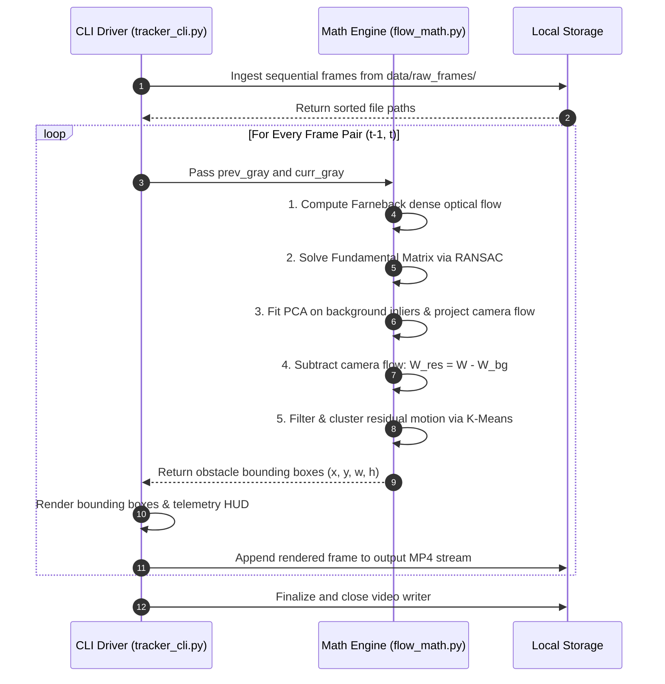

# Ego-Motion Compensated Multi-Object Tracker (KITTI)


A modular, terminal-based computer vision system that isolates and tracks dynamic obstacles from a moving camera platform. By decoupling camera ego-motion from scene dynamics using Epipolar geometry (RANSAC) and Principal Component Analysis (PCA), this system isolates independently moving objects without relying on black-box neural networks.

---

## Computer Vision Topics & Technical Application

| Computer Vision Topic | Theoretical Concept & Relevance | Pipeline Implementation & Application |
| :--- | :--- | :--- |
| **Dense Optical Flow (Farneback)** | Solves the brightness constancy constraint using quadratic polynomial expansions over local pixel neighborhoods. | Computes a complete 2D motion vector field between consecutive frames, capturing both camera translation and object displacements. |
| **Epipolar Geometry & Fundamental Matrix** | Models rigid two-view geometric relationships, defining the projection of static 3D world points across views. | Establishes the geometric foundation of the static environment as the autonomous vehicle translates forward through the scene. |
| **RANSAC (Random Sample Consensus)** | Iterative estimator that computes mathematical model parameters from data containing extreme proportions of outliers. | Filters out moving foreground objects that violate epipolar constraints, preserving only rigid background pixels for camera motion modeling. |
| **Principal Component Analysis (PCA)** | Orthogonal linear transformation that maps data into a lower-dimensional subspace along axes of maximal variance. | Computes the top principal components of verified background motion vectors to reconstruct the camera's true ego-motion field. |
| **Residual Motion Subtraction** | Signal decomposition technique to isolate anomalies not explained by a dominant parametric transformation model. | Computes the residual vector field and evaluates magnitude to reveal true moving obstacles. |
| **Morphological Filtering** | Non-linear neighborhood operations (Opening and Closing) based on set theory to regularize binary spatial structures. | Eliminates high-frequency noise artifacts and closes internal spatial voids in the dynamic obstacle mask. |
| **Spatial K-Means Clustering** | Unsupervised partition clustering that minimizes within-cluster sum-of-squares over geometric coordinate spaces. | Groups contiguous clusters of active residual pixels into discrete obstacle bounding boxes with coordinate tracking. |

---

## System Architecture



---

## Process Sequence Workflow



---

## Key Features

* **Ego-Motion Compensation:** Filters out background parallax so curbside parked cars and roadside infrastructure are not misidentified as dynamic hazards.
* **Classical Algorithmic Rigor:** Built entirely on verifiable linear algebra and classical vision techniques without requiring pre-trained deep learning weights.
* **Headless Terminal Pipeline:** Runs 100% via the command line with zero display/GUI dependencies, making it suitable for remote servers and CI environments.
* **High-Throughput Execution:** Highly vectorized matrix calculations using NumPy and OpenCV C-extensions, executing at ~14 FPS on Apple Silicon.

---

## Performance Benchmarks

*Evaluated on an Apple M2 processor (8-core CPU, 8GB Unified Memory) running macOS Darwin ARM64:*

* **Input Resolution:** 1242 × 375 pixels
* **Frames Processed:** 108 frames
* **Average Step Latency:** 59.3 ms / frame
* **Throughput:** 14.2 FPS
* **Total Runtime:** 7.56 seconds
* **Display Backend:** None (100% Headless Execution)

---

## Repository Structure

```text
kitti-ego-tracker/
├── README.md              
├── statement.md           
├── data/
│   ├── raw_frames/        
│   └── processed/         
├── output/                
└── src/
    ├── __init__.py        
    ├── flow_math.py       
    └── tracker_cli.py     
```

---

## Installation & Setup

Step 1: Clone the repository
```bash
git clone [https://github.com/alokpatel4357/kitti-ego-tracker.git](https://github.com/alokpatel4357/kitti-ego-tracker.git)
```

Step 2: Enter the directory
```bash
cd kitti-ego-tracker
```

Step 3: Initialize an isolated virtual environment
```bash
python3 -m venv venv
```

Step 4: Activate the environment
```bash
source venv/bin/activate
```

Step 5: Install dependencies
```bash
pip install numpy opencv-python scikit-learn
```

---

## Dataset Setup

Download and unpack the sample KITTI raw driving sequence (~40 MB). Run these commands one after the other:

Step 1: Download the zip archive
```bash
curl -L -o kitti_sample.zip "[https://s3.eu-central-1.amazonaws.com/avg-kitti/raw_data/2011_09_26_drive_0001/2011_09_26_drive_0001_sync.zip](https://s3.eu-central-1.amazonaws.com/avg-kitti/raw_data/2011_09_26_drive_0001/2011_09_26_drive_0001_sync.zip)"
```

Step 2: Unpack frames directly into the data folder
```bash
unzip -j kitti_sample.zip "2011_09_26/2011_09_26_drive_0001_sync/image_02/data/*" -d data/raw_frames/
```

Step 3: Clean up the archive
```bash
rm kitti_sample.zip
```

---

## Execution & CLI Usage

Execute the tracker directly through the command line:

**Standard Run:**
```bash
python src/tracker_cli.py --input_dir data/raw_frames --output_video output/kitti_tracked.mp4
```

**Sensitivity Tuning (for slower or distant obstacles):**
```bash
python src/tracker_cli.py --input_dir data/raw_frames --output_video output/kitti_tracked_sensitive.mp4 --motion_thresh 1.8
```

---

## Automated Testing & Verification

Run this automated mathematical self-test to verify matrix dimensions, epipolar convergence, and clustering logic before running full sequences:

```bash
python -c "
import numpy as np
from src.flow_math import compute_dense_flow, estimate_epipolar_inliers, isolate_residual_motion_pca, extract_moving_clusters

f1 = np.random.randint(0, 255, (375, 1242), dtype=np.uint8)
f2 = np.roll(f1, 2, axis=1)

flow = compute_dense_flow(f1, f2)
inliers, F = estimate_epipolar_inliers(flow)
residual, _ = isolate_residual_motion_pca(flow, inliers)
boxes, _ = extract_moving_clusters(residual)

assert flow.shape == (375, 1242, 2), 'Flow shape mismatch'
assert residual.shape == (375, 1242), 'Residual shape mismatch'
assert F is not None, 'Fundamental Matrix calculation failed'
print('All pipeline tests passed successfully.')
"
```

---

## Contributing

Contributions are welcome. Please ensure that any pull requests maintain the 100% headless execution constraint and do not introduce GUI dependencies. For major architectural changes, please open an issue first to discuss the proposed updates.

## License

This project is licensed under the MIT License - see the [LICENSE](LICENSE) file for details.

Copyright (c) 2026 Alok Kumar Patel
